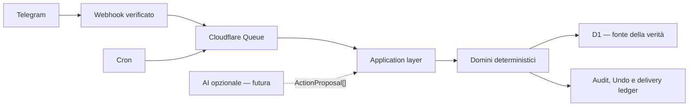

# Tessavio

[](https://github.com/Sunacchi/Tessavio/actions/workflows/ci.yml)

Assistente personale multiutente per Telegram, costruito su Cloudflare Workers.
Tessavio trasforma comandi e, in futuro, input naturali in operazioni
deterministiche, autorizzate e verificabili su agenda, reminder, task, lavoro e
finanze personali.

> [!IMPORTANT]
> Tessavio è in sviluppo iniziale. Foundation e milestone B1-B6.2 sono
> completate e validate localmente; B7 è prevista ma non ancora attiva.
> Non esiste ancora un deploy Cloudflare pubblico e il progetto non è pronto per
> dati o utenti di produzione.

## Perché Tessavio

- **Funziona senza AI:** il core deterministico resta utilizzabile quando un
  provider non è configurato o disponibile.
- **D1 è la fonte della verità:** l'AI potrà soltanto proporre azioni strutturate;
  validator, policy e servizi di dominio decideranno se applicarle.
- **Multi-tenant dal primo giorno:** ogni accesso ai dati usa uno scope utente o
  spazio esplicito.
- **Retry sicuri:** write ed effetti esterni sono idempotenti, auditabili e,
  quando possibile, annullabili.
- **Tempo e denaro corretti:** timezone IANA e date civili esplicite; importi in
  unità minori intere, mai `float`.

La [visione di prodotto](docs/PROJECT.md) descrive lo scope completo; la
[milestone corrente](docs/planning/CURRENT_MILESTONE.md) è l'unico perimetro
autorizzato per l'implementazione.

## Funzionalità disponibili

| Area       | Disponibile oggi                                                                            |
| ---------- | ------------------------------------------------------------------------------------------- |
| Fondazione | Webhook Telegram, Queue, identità interna, rate limit, idempotenza, audit e logging redatto |
| Preferenze | Lingua, timezone IANA, formato ora, valuta, privacy e quiet hours                           |
| Agenda     | Eventi privati one-off, date-only o temporali, con viste `/oggi` e `/domani`                |
| Reminder   | One-off e ricorrenti daily/weekly, Cron, Queue, retry, deduplica e delivery Telegram        |
| Task       | Priorità, scadenze, completamento, riapertura e Undo                                        |
| Lavoro     | Regole, turni pianificati, consuntivi, pause e report per periodo                           |
| Finanze    | Spese ed entrate manuali, correzione, soft delete, Undo e totali esatti per valuta          |
| Liste/note | Liste private, item, note standalone, versioning, soft delete e Undo                        |

Non sono ancora implementati AI/BYOK, input multimediali, ricorrenze diverse dai
reminder daily/weekly, Google Calendar, Mini App o deploy di produzione. Open
Banking e pagamenti sono esclusi dal prodotto.

## Architettura



Il webhook esegue soltanto verifica, validazione, deduplica ed enqueue. Ogni
write attraversa authorization, validazione, policy e servizio di dominio.
L'[architettura completa](docs/architecture/ARCHITECTURE.md) documenta confini,
flussi e invarianti.

## Avvio locale

### Prerequisiti

- Git;
- Node.js `24.13.1`;
- npm `11.8.0`;
- un bot Telegram di sviluppo con token e webhook secret dedicati.

Le versioni npm sono fissate in `package.json` e `package-lock.json`.

### Installazione

```powershell
git clone https://github.com/Sunacchi/Tessavio.git
Set-Location Tessavio
npm ci
Copy-Item .dev.vars.example .dev.vars
```

Inserire in `.dev.vars` soltanto credenziali di sviluppo:

```dotenv
TELEGRAM_WEBHOOK_SECRET=replace-with-a-random-development-secret
TELEGRAM_BOT_TOKEN=replace-with-a-development-bot-token
```

Non committare `.dev.vars` e non usare segreti di produzione in locale.

Applicare le migration al database D1 locale e avviare il Worker:

```powershell
npx wrangler d1 migrations apply DB --local --persist-to .wrangler/state
npm run dev
```

Il Worker locale conserva lo stato in `.wrangler/state`. Per un flusso Telegram
completo serve inoltre un endpoint HTTPS raggiungibile dal webhook. Consultare il
[runbook di sviluppo](docs/runbooks/DEVELOPMENT.md) e quello di
[provisioning D1](docs/runbooks/D1_PROVISIONING.md) prima di configurare ambienti
remoti.

## Comandi Telegram

La superficie deterministica attuale comprende:

| Comando              | Scopo                                       |
| -------------------- | ------------------------------------------- |
| `/start`             | Onboarding e identificazione utente         |
| `/impostazioni`      | Lettura e modifica delle preferenze         |
| `/evento`            | Gestione degli eventi one-off               |
| `/oggi`, `/domani`   | Agenda ed elementi in scadenza              |
| `/promemoria`        | Gestione dei reminder                       |
| `/task`              | Gestione delle task                         |
| `/lavoro`            | Turni, consuntivi, pause e report           |
| `/finanze`, `/spese` | Movimenti e totali per valuta               |
| `/liste`             | Liste private e relativi item               |
| `/note`              | Note testuali private                       |
| `/annulla`           | Undo single-use delle operazioni supportate |

I contratti esatti sono versionati negli
[ADR](docs/decisions/README.md) e nei [runbook](docs/README.md), evitando che il
README diventi una seconda specifica destinata a divergere.

## Sviluppo e verifica

Il gate completo usato anche dalla CI è:

```powershell
npm run validate
```

Comprende formattazione, lint, verifica dei tipi Cloudflare, typecheck, controllo
dello schema Drizzle, test e build Worker dry-run.

| Comando                    | Verifica                                |
| -------------------------- | --------------------------------------- |
| `npm run format:check`     | Formattazione Prettier                  |
| `npm run lint`             | Regole ESLint                           |
| `npm run typecheck`        | TypeScript strict                       |
| `npm run db:check`         | Coerenza schema/migration Drizzle       |
| `npm run test:unit`        | Regole di dominio                       |
| `npm run test:integration` | Flussi applicativi, Queue e migration   |
| `npm run test:security`    | Authorization e isolamento cross-tenant |
| `npm run build`            | Bundle Cloudflare Workers in dry-run    |

La [strategia di test](docs/TESTING.md) copre anche idempotenza, retry, casi DST,
property test monetari e recovery.

## Struttura del repository

| Percorso             | Responsabilità                            |
| -------------------- | ----------------------------------------- |
| `src/entrypoints`    | Handler HTTP, Queue e Cron                |
| `src/application`    | Use case, porte, routing e orchestrazione |
| `src/domains`        | Regole pure e AI-independent              |
| `src/infrastructure` | Repository D1 e adapter infrastrutturali  |
| `src/security`       | Authorization e gestione dei segreti      |
| `src/telegram`       | Contratti e adapter Telegram              |
| `migrations`         | Migration D1 versionate                   |
| `tests`              | Test unitari, integration e security      |
| `docs`               | Specifiche, ADR, pianificazione e runbook |

Per i vincoli tra layer vedere la
[struttura architetturale](docs/architecture/REPOSITORY_STRUCTURE.md).

## Documentazione

- [Indice completo](docs/README.md)
- [Visione e requisiti](docs/PROJECT.md)
- [Architettura](docs/architecture/ARCHITECTURE.md)
- [Roadmap](docs/planning/ROADMAP.md)
- [Copertura dei requisiti](docs/planning/REQUIREMENTS_COVERAGE.md)
- [Definition of Done](docs/planning/DEFINITION_OF_DONE.md)
- [Decisioni architetturali](docs/decisions/README.md)
- [Sicurezza](SECURITY.md)

## Contribuire e chiedere supporto

Prima di proporre modifiche leggere [AGENTS.md](AGENTS.md), la
[milestone corrente](docs/planning/CURRENT_MILESTONE.md) e la
[Definition of Done](docs/planning/DEFINITION_OF_DONE.md). Il progetto accetta
solo lavoro coerente con la vertical slice attiva; niente scaffold speculativo
per milestone future.

Bug e proposte non sensibili possono essere discussi nelle
[GitHub Issues](https://github.com/Sunacchi/Tessavio/issues). Le vulnerabilità non
devono essere pubblicate in una issue: seguire la procedura descritta in
[SECURITY.md](SECURITY.md).

Il progetto è mantenuto da [Sunacchi](https://github.com/Sunacchi).

## Licenza

Non è ancora stata pubblicata una licenza. La visibilità pubblica del repository
non concede automaticamente diritti di utilizzo, modifica o redistribuzione;
non considerare Tessavio open source finché non verrà aggiunto un file
`LICENSE`.
