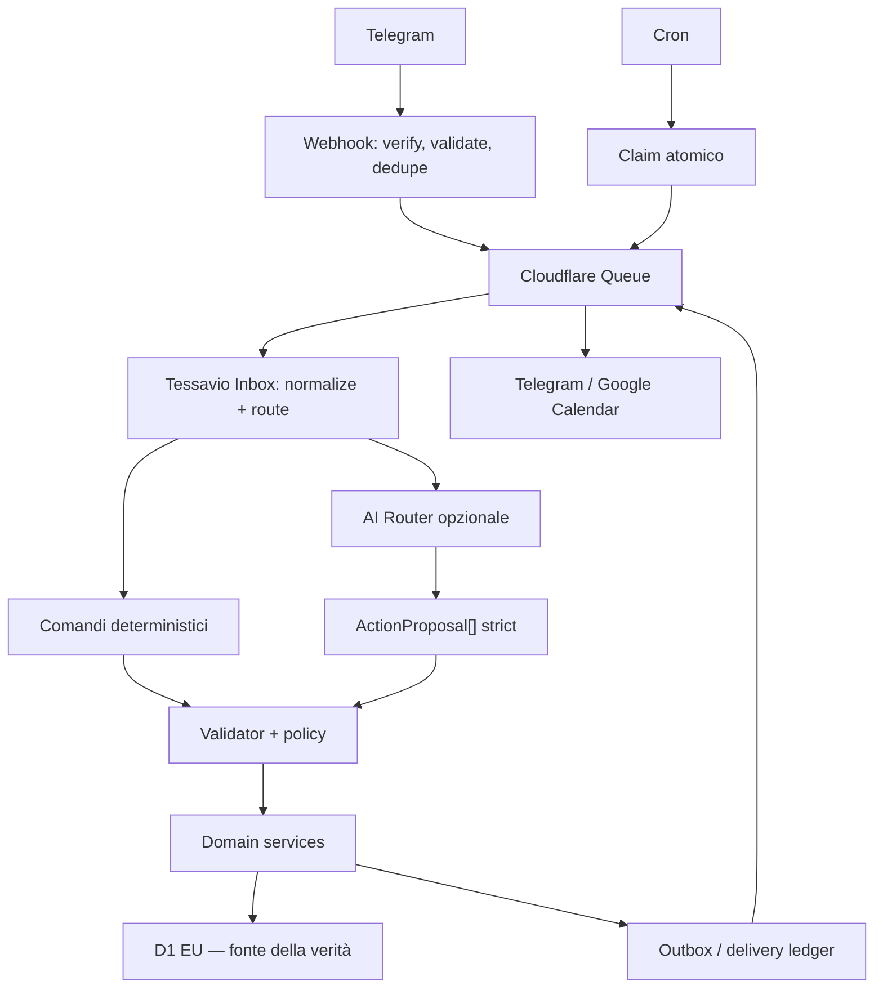

# Architettura

> Confini, flussi critici ed evoluzione dello schema. Aprire quando una
> modifica attraversa un layer. Per sapere **dove va un file** basta
> [REPOSITORY_STRUCTURE](REPOSITORY_STRUCTURE.md), che è molto più corto.

## Vista d'insieme



## Confini

### Entrypoints

`fetch`, `queue` e `scheduled` traducono eventi Cloudflare in input applicativi.
Non contengono logica di dominio. Il webhook esegue solo controlli HTTP/secret,
validazione, dedupe, registrazione Inbox, enqueue e risposta rapida.

### Telegram

Gestisce Bot API, messaggi, tastiere, comandi e metadata minimi di provenance.
L'identità Telegram viene mappata a un ID interno prima dell'accesso al dominio.
File e media si scaricano solo nel consumer, con allowlist, limiti e lifecycle
transitorio.

### Application e Tessavio Inbox

La Inbox è un punto di acquisizione, non un aggregate di dominio. Normalizza
testo, forward, link e allegati supportati, conserva solo provenance necessaria e
instrada verso comandi oppure `ActionProposal[]`. Un input può produrre più
proposte con idempotency key distinte; nessuna proposta scrive da sola.

Application orchestra use case, validator, confirmation policy, transazioni
bounded, audit, Undo e idempotenza. Ambiguità produce una domanda mirata; azioni
sensibili, distruttive, bulk o condivise richiedono preview.

### Domains

I domini sono moduli deterministici, AI-independent e con persistenza propria:

- identità e preferenze;
- agenda, reminder, task, lavoro, planner e routine;
- finanze personali;
- liste e note;
- documenti e amministrazione;
- persone e follow-up;
- spazi, casa e famiglia;
- viaggi;
- briefing/attention e report;
- privacy, export e cancellazione.

Un modulo non legge direttamente le tabelle di un altro. Collegamenti
cross-domain sono riferimenti tipizzati e tenant-scoped introdotti con la slice
che li usa; non si crea una tabella universale o una FK polimorfa speculativa.
Il proprietario del dato resta il dominio sorgente: per esempio il documento
conserva provenance estratta, mentre la spesa validata resta autorevole in
finanze.

### AI

Espone adapter provider-agnostic per structured completion, trascrizione, vision,
reasoning e usage. Il router seleziona per capability, benchmark, latenza, costo,
modalità utente, privacy, budget e disponibilità.

Classi:

- T0: nessuna AI;
- T1: estrazione strutturata testuale;
- T2: estrazione multimodale;
- T3: normalizzazione di vincoli e spiegazione;
- T-STT: trascrizione dedicata.

L'AI non riceve SQL, repository, credenziali o accesso diretto a D1.

### Infrastructure

Implementa repository D1, Queue, outbox/delivery ledger, crittografia, clock,
logging, ID e storage transitorio. Tutte le query tenant-scoped includono owner o
space scope. Parser di file, CSV e contenuti remoti sono confini non fidati.

### Integrations

Le integrazioni sono adapter opzionali e non diventano fonti della verità dei
domini. Google Calendar è l'unica integrazione nella roadmap corrente:

- H1 export controllato con OAuth, mapping, outbox e retry;
- H2 riconciliazione/import in staging;
- H3 sync bidirezionale con conflict policy e loop prevention.

D1 resta autorevole e ogni modifica importata attraversa gli stessi validator e
servizi del core. Gmail, Drive, Contacts, Tasks, meteo, mappe e altri servizi sono
differiti. Open Banking, adapter bancari e pagamenti sono vietati da ADR-0009.

### Security

Centralizza authorization, encryption, rate limiting, data classification e
privacy. È un confine obbligatorio per ogni use case. Documenti personali,
finanze, relazioni e benessere richiedono context minimization, export/delete e
retention espliciti prima della persistenza.

## Flussi critici

### Telegram inbound

1. accetta solo `POST` sul path esatto;
2. applica limiti e verifica `X-Telegram-Bot-Api-Secret-Token`;
3. valida e normalizza il JSON minimo;
4. registra/deduplica `update_id` prima del publish;
5. pubblica `INBOUND_MESSAGE` e risponde rapidamente;
6. il consumer ricostruisce identità/scope, classifica e instrada;
7. validator/policy/domain eseguono, auditano e producono risposta.

### ActionProposal

```text
LLM -> JSON Schema strict -> Zod -> tenant/permission validator
    -> semantic/conflict/budget/risk policy -> domanda | preview | domain command
    -> persistence + audit + Undo token -> risposta
```

La confidence del modello non autorizza nulla. Ambiguità deriva da segnali
deterministici: campi mancanti, interpretazioni multiple, timezone assente,
duplicati, bulk, dati sensibili o azioni distruttive/condivise.

### Reminder, briefing e notifiche

Cron seleziona record pending e dovuti con claim condizionale; solo chi modifica
la riga pubblica il job. La delivery usa una dedupe key univoca, rispetta quiet
hours e preference snapshot, classifica errori e impedisce di ripetere lo stesso
avviso logico. Briefing e report aggregano viste autorizzate tramite porte dei
domini, senza query cross-domain libere.

### Google Calendar

Le mutation locali committano prima in D1 e registrano un'operazione outbox. Il
consumer applica l'operazione idempotente usando mapping locale/esterno
tenant-scoped. Riconciliazione e import producono divergence record/proposte;
solo una conflict policy può trasformarli in mutation Tessavio. Delete,
tombstone, all-day, timezone e ricorrenze hanno semantica esplicita.

### Media e documenti

Il consumer verifica tipo/dimensione, scarica in storage transitorio, estrae con
provenance e cancella in `finally`. Il risultato utile può diventare proposta o
metadata. Conservare il documento originale richiede un use case esplicito,
cifratura, authorization e retention; non è un effetto automatico dell'Inbox.

### Tempo e denaro

- evento one-off: UTC start/end più timezone originale;
- scadenza senza ora: `due_date_local`, non timestamp arbitrario;
- ricorrenza: ora locale e timezone IANA preservate;
- date relative: timestamp messaggio + data locale + timezone utente;
- denaro: minor unit intere e valuta esplicita;
- split: somma delle quote uguale all'importo, con regola di arrotondamento
  deterministica;
- forecast: formula/versione/provenance e disclaimer, mai consulenza.

## Dati e schema evolutivo

Lo schema arriva una vertical slice alla volta. Ogni riga elenca **solo** ciò che
la slice ha aggiunto; il contratto completo è nell'ADR corrispondente.

| Slice      | Tabelle e concetti aggiunti                                                                                                                                                                                                                                                                                 | ADR                                                          |
| ---------- | ----------------------------------------------------------------------------------------------------------------------------------------------------------------------------------------------------------------------------------------------------------------------------------------------------------- | ------------------------------------------------------------ |
| A1         | identità, inbox, rate/lease, effect, delivery, audit                                                                                                                                                                                                                                                        | [0008](../decisions/0008-a1-foundation-decisions.md)         |
| B1.1       | preferenze utente, record Undo temporanei user-scoped                                                                                                                                                                                                                                                       | [0012](../decisions/0012-b1-preferences-and-undo.md)         |
| B1.2       | eventi privati `date_only\|instant`, Undo eventi                                                                                                                                                                                                                                                            | [0013](../decisions/0013-b1-one-off-event-time-contract.md)  |
| B2         | reminder one-off privati, snapshot quiet hours, claim leased, ledger delivery dedicato (nessuna ricorrenza)                                                                                                                                                                                                 | [0014](../decisions/0014-b2-reminder-delivery.md)            |
| B3         | task private `none\|date_only\|instant`, priorità, state machine open/completed                                                                                                                                                                                                                             | [0015](../decisions/0015-b3-task-contract.md)                |
| B4         | regole lavoro versionate, turni pianificati, consuntivi con snapshot della regola, pause figlie — tabelle distinte, report su intervalli UTC clamped a finestre civili IANA                                                                                                                                 | [0016](../decisions/0016-b4-work-time-contract.md)           |
| B5         | registro `expense\|income`, importi positivi in minor unit, valuta e data civile esplicite, provenance manuale, soft delete. Totali separati per valuta con somme testuali D1 e `bigint`: nessuna conversione, nessun `float`                                                                               | [0017](../decisions/0017-b5-finance-contract.md)             |
| B6.1       | liste, item e note in tabelle distinte; FK item/lista composta con `user_id`; soft delete (nessuna condivisione)                                                                                                                                                                                            | [0018](../decisions/0018-b6-private-lists-notes-contract.md) |
| B6.2       | regole reminder `daily\|weekly` e mapping delle occorrenze, additive. Il Cron scopre solo owner/ID dovuti; la mutation scoped genera un reminder one-off con provenance `calculated_recurrence` e avanza il cursore civile via Temporal. CAS e unicità dello slot fanno convergere retry e Cron concorrenti | [0019](../decisions/0019-b6-minimal-reminder-recurrence.md)  |
| B7         | **nessuno schema nuovo**: compone letture user-scoped di eventi, task, lavoro e finanze tramite le rispettive porte, con finestra civile IANA, limite per contributor, formula/provenance versionate e CSV transitorio                                                                                      | [0020](../decisions/0020-b7-base-reports.md)                 |
| Chiusura B | **nessuno schema nuovo**: `/oggi` compone eventi, task, reminder operativi e turni pianificati attraverso porte separate, con authorization per contributor e limiti bounded                                                                                                                                | [0021](../decisions/0021-phase-b-closure.md)                 |

Regole di lifecycle già in vigore:

- i token Undo scaduti si eliminano solo nello scope dell'utente;
- il delivery ledger reminder elimina dopo 30 giorni **solo** stati terminali e
  preserva i tentativi attivi;
- ogni categoria futura definisce owner/space, indici, lifecycle, export/delete,
  audit/Undo e test cross-tenant **quando entra in scope**, non prima.

Non creare tabelle per Open Banking, integrazioni differite o domini futuri prima
della relativa milestone. Prima di ogni gate: `EXPLAIN QUERY PLAN` sulle query
hot e validazione delle migration fresh/upgrade/recovery.

## Affidabilità

- correlation ID end-to-end;
- trasporto at-least-once, una sola esecuzione logica;
- retry solo per errori temporanei e dedupe degli effetti esterni;
- outbox per Google e altri side effect che seguono una mutation D1;
- circuit breaker e fallback AI compatibili con privacy/costo;
- graceful degradation a comandi/core deterministici;
- soft delete per finestra Undo, poi purge secondo policy;
- conflitti esterni osservabili e risolvibili, mai last-write-wins cieco.

## Residenza e capacità

`jurisdiction=eu` garantisce la collocazione di esecuzione e persistenza del
solo D1. Worker HTTP, Queue, Cron, Telegram, subrequest e provider AI seguono
controlli separati; il data-flow e i gate pre-pilot sono nella
[matrice di residenza](../privacy/PROCESSOR_AND_RESIDENCY_MATRIX.md).

Il singolo D1 condiviso è single-threaded e limitato a 10 GB. Prima del pilot si
misurano dimensione, p95 delle query hot, errori `overloaded`, write throughput
e Queue lag. I trigger e il go/no-go sono nel
[runbook pre-pilot](../runbooks/PRE_PILOT_OPERATIONS.md); superarli riapre
ADR-0003, non autorizza query non scoped o sharding speculativo.
