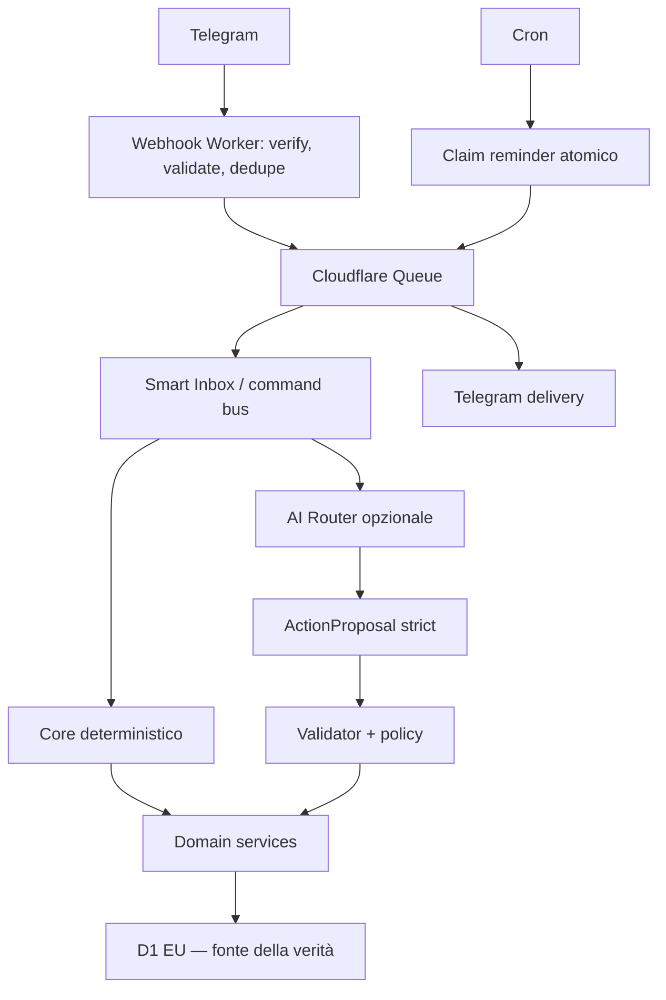

# Architettura

## Vista d'insieme



## Confini

### Entrypoints

`fetch`, `queue` e `scheduled` traducono eventi Cloudflare in input applicativi. Non contengono logica di dominio.

### Telegram

Gestisce protocollo Bot API, webhook, messaggi, tastiere e comandi. L'identità Telegram viene mappata a un ID utente interno prima dell'accesso al dominio.

### Application

Orchestra use case, Smart Inbox, command bus, ActionProposal validator/executor e policy di conferma. Coordina transazioni e idempotenza senza incorporare dettagli Telegram o provider AI.

### Domains

Contengono regole pure per utenti, agenda, reminder, task, planner, lavoro, spese, liste, routine, spazi e report. Dipendono da porte, non da D1, Workers o SDK esterni.

### AI

Espone un adapter provider-agnostic per trascrizione, structured completion, vision, reasoning e usage. Il router seleziona per capability, benchmark, latenza, costo, modalità utente, privacy, budget e disponibilità.

Classi iniziali:

- T0: nessuna AI;
- T1: estrazione strutturata economica;
- T2: estrazione multimodale;
- T3: reasoning/planning;
- T-STT: trascrizione dedicata.

### Infrastructure

Implementa repository D1, Queue, crittografia, clock, logging e ID. Tutte le query tenant-scoped includono owner/space scope.

### Security

Centralizza authorization, encryption, rate limiting e privacy. È un confine obbligatorio per ogni use case, non una utility opzionale.

## Flussi critici

### Telegram inbound

1. accetta solo `POST`;
2. verifica `X-Telegram-Bot-Api-Secret-Token`;
3. valida il JSON;
4. registra/deduplica `update_id`;
5. pubblica `INBOUND_MESSAGE`;
6. risponde rapidamente con `200`.

Il queue consumer normalizza, classifica, usa eventualmente l'AI, produce e valida proposte, applica policy, esegue il dominio e risponde con correlation ID continuo.

### Reminder

Il Cron seleziona reminder `pending` e dovuti. Ogni riga viene acquisita con update condizionale `pending -> claimed`; solo chi modifica una riga pubblica `SEND_NOTIFICATION`. La delivery usa una `dedupe_key` univoca, classifica errori temporanei/permanenti e registra l'esito.

### ActionProposal

```text
LLM -> JSON Schema strict -> Zod -> tenant/permission validator
    -> ambiguity/conflict/budget policy -> preview oppure domain command
    -> audit + undo token -> risposta
```

La confidence dichiarata dal modello non decide nulla. Ambiguità deriva da segnali deterministici: campi mancanti, più interpretazioni, timezone assente, duplicati, bulk o azione distruttiva.

### Tempo

- evento one-off: UTC start/end più timezone originale;
- scadenza senza ora: `due_date_local`, non timestamp arbitrario;
- ricorrenza: ora locale e timezone IANA preservate;
- date relative: timestamp messaggio + data locale + timezone utente;
- un unico Temporal polyfill, con test DST.

## Dati principali

Lo schema completo verrà introdotto per milestone. Le categorie previste sono: identità/preferenze/inviti, OAuth e AI usage, update/inbox/proposte, eventi/task/reminder, lavoro, spese/liste, spazi, delivery, integrazioni, audit/undo, budget e model policy.

Gli indici iniziali devono coprire identità Telegram, query temporali per owner/space, reminder dovuti, turni, spese, membership, usage, audit, delivery dedupe e routine. Prima della beta eseguire `EXPLAIN QUERY PLAN` sulle query hot.

## Affidabilità

- correlation ID end-to-end;
- retry solo per errori temporanei;
- circuit breaker provider;
- fallback AI soltanto compatibile, privacy-equivalente e sotto costo massimo;
- graceful degradation a comandi/core deterministici;
- soft delete per la finestra Undo, poi purge.
