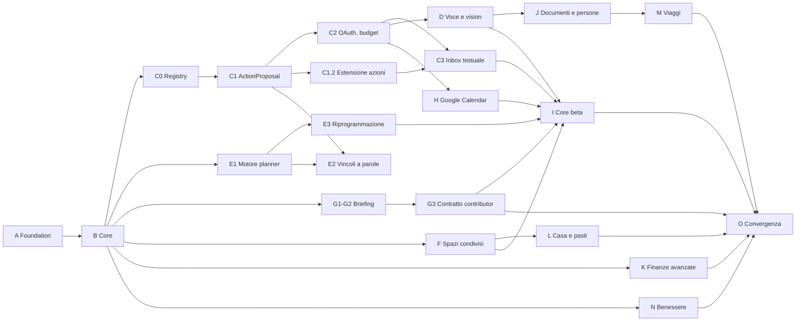

# Piani di fase

Una fase per file. Aprire **soltanto** il file della fase attiva secondo
[CURRENT_MILESTONE](../CURRENT_MILESTONE.md); le altre sono impegni ordinati,
non autorizzazioni a implementare.

## Indice

| Fase | File                                         | Stato      | Contenuto                                                    |
| ---- | -------------------------------------------- | ---------- | ------------------------------------------------------------ |
| A    | [a-foundation.md](a-foundation.md)           | completata | webhook, Queue, identità, idempotenza, audit                 |
| B    | [b-core.md](b-core.md)                       | completata | core deterministico B1-B7                                    |
| C    | [c-ai-byok.md](c-ai-byok.md)                 | non attiva | registry, `ActionProposal`, OpenRouter OAuth, Inbox testuale |
| D    | [d-media.md](d-media.md)                     | non attiva | voce, vision e allegati transitori                           |
| E    | [e-planner.md](e-planner.md)                 | non attiva | planner deterministico, preview/apply, riprogrammazione      |
| F    | [f-sharing.md](f-sharing.md)                 | non attiva | `SpaceScope`, membership, ruoli, spese condivise             |
| G    | [g-proactive.md](g-proactive.md)             | non attiva | briefing, riepiloghi, contratto dei contributor              |
| H    | [h-google-calendar.md](h-google-calendar.md) | non attiva | export, riconciliazione, sync bidirezionale                  |
| I    | [i-beta.md](i-beta.md)                       | non attiva | Mini App, export/delete, gate della core beta                |
| J    | [j-documenti.md](j-documenti.md)             | non attiva | documenti, archivio cifrato, persone, follow-up              |
| K    | [k-finanze.md](k-finanze.md)                 | non attiva | regole e ricorrenze, budget, forecast, report e import CSV   |
| L    | [l-casa.md](l-casa.md)                       | non attiva | manutenzione, inventario, pasti e lista spesa derivata       |
| M    | [m-viaggi.md](m-viaggi.md)                   | non attiva | viaggi, tappe con timezone propria, prenotazioni acquisite   |
| N    | [n-benessere.md](n-benessere.md)             | non attiva | routine, reminder di salute non clinici, energia percepita   |
| O    | [o-convergenza.md](o-convergenza.md)         | non attiva | ricerca cross-domain, contributor, gate del prodotto esteso  |

Quindici fasi in tutto: **A e B chiuse, tredici davanti**. I è il gate della
core beta, O quello del prodotto esteso. Chiusura di un gate:
[RELEASE_CLOSURE.md](../RELEASE_CLOSURE.md).

## Dipendenze reali

Il grafo mostra ciò che **blocca davvero**, non l'ordine alfabetico. Le fasi si
numerano in sequenza per leggibilità, ma tre di esse possono partire prima di
quanto la lettera suggerisca.

### Cosa blocca cosa

| Se vuoi partire con… | Devi avere chiuso          | Perché                                                       |
| -------------------- | -------------------------- | ------------------------------------------------------------ |
| C1                   | C0                         | l'executor ha bisogno del registry di dispatch               |
| C2                   | C1 e le decisioni G0.2     | callback live e credenziali restano un gate del proprietario |
| **E1**               | **solo B**                 | l'allocatore è deterministico e non chiama alcun modello     |
| E2                   | E1 e C1                    | i vincoli a parole passano dal validator                     |
| **G1 e G2**          | **solo B**                 | il briefing compone domini già chiusi                        |
| D                    | C1 e C2                    | la trascrizione entra nella pipeline e consuma budget        |
| H                    | il router pubblico di C2.1 | i callback Google richiedono HTTPS raggiungibile             |
| L                    | F                          | senza spazi non esiste il destinatario familiare             |
| J                    | D3                         | l'estrazione da documenti arriva da lì                       |
| M                    | J (e F se condiviso)       | le prenotazioni acquisite seguono il ciclo di vita di J      |
| I                    | C, D, E, F, G, H           | è il gate che li dimostra insieme                            |
| O                    | I e J-N                    | è il gate del prodotto esteso                                |

### Le due correzioni

Fino al 2026-08-19 due file dichiaravano dipendenze più larghe di quelle reali,
e avrebbero fatto rimandare lavoro già eseguibile:

- **E** dichiarava di dipendere da C "per la normalizzazione dei vincoli", ma il
  suo stesso piano prescrive un allocatore senza AI. Solo **E2** dipende da C1:
  E1 ed E3 no.
- **G** dichiarava di dipendere da B, E ed F, ma **G1** e **G2** usano soltanto
  eventi, task, reminder e turni, tutti chiusi in Phase B.

Conseguenza pratica: **E1 e G1 sono le uniche fasi che possono procedere in
parallelo a C** invece che dopo di essa.

## Livello di dettaglio

I piani non hanno tutti la stessa profondità, ed è voluto: una fase lontana
pianificata nel dettaglio oggi viene riscritta prima che qualcuno la apra.

| Livello             | Fasi             | Contiene                                                         |
| ------------------- | ---------------- | ---------------------------------------------------------------- |
| piano esecutivo     | C, D, E          | slice, contratti da congelare, file posseduti, test obbligatori  |
| piano di fase       | F, G, H, I       | slice, gate d'ingresso, decisioni, rischi, criteri di uscita     |
| impegno di prodotto | J, K, L, M, N, O | outcome, confini, decisioni da prendere prima, criteri di uscita |

Quando una fase diventa la prossima, il main agent la porta al livello
superiore **prima** di attivarla: è la stessa cosa fatta per C il 2026-08-19.
