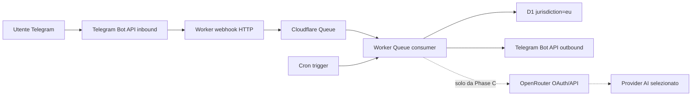

# Matrice di residenza, flussi e subprocessori

> Dove passano e risiedono i dati, passaggio per passaggio. Aprire quando
> aggiungi un servizio esterno o devi rispondere sulla residenza: la
> giurisdizione del database non basta a dedurla.

## Regola

`jurisdiction=eu` vincola soltanto dove il database D1 esegue e persiste i
dati. Non regionalizza automaticamente Worker, Queue, Cron, Telegram, subrequest
o provider AI. Cloudflare documenta inoltre che Regional Services:

- si applica al custom domain configurato, mentre codice e secret Worker restano
  distribuiti globalmente;
- non si estende alle subrequest in uscita;
- non si applica ai trigger Queue o Cron.

Fonti primarie:
[D1 data location](https://developers.cloudflare.com/d1/configuration/data-location/),
[Workers e Regional Services](https://developers.cloudflare.com/data-localization/how-to/workers/).

## Data-flow

I log ricevono soltanto ID opachi, codici e metriche; non sono un ramo del
payload personale. I media futuri restano transitori e non entrano in A1.

## Matrice pre-pilot

| Passaggio                 | Dati minimi                                                   | Servizio/controparte da registrare                           | Garanzia geografica nota                                                                     | Gate prima del pilot                                                                                                                                                                                 |
| ------------------------- | ------------------------------------------------------------- | ------------------------------------------------------------ | -------------------------------------------------------------------------------------------- | ---------------------------------------------------------------------------------------------------------------------------------------------------------------------------------------------------- |
| Telegram -> webhook       | ID Telegram, chat/message ID, timestamp, comando normalizzato | Telegram e subprocessori dichiarati nei termini applicabili  | nessuna garanzia derivata da D1                                                              | finalità/base giuridica, paesi, trasferimenti, retention e delete verificati                                                                                                                         |
| Worker HTTP               | header tecnico, update normalizzato, correlation ID           | Cloudflare Workers                                           | globale salvo Regional Services sul custom domain; codice/secret comunque globali            | decidere Regional Services/CMB e verificare contratti, log e regioni                                                                                                                                 |
| Queue e Cron              | envelope versionato con payload minimo e chiavi opache        | Cloudflare Queues/Workers                                    | non coperti dalla regionalizzazione del custom domain                                        | retention 24 ore, DLQ/alert/replay, trasferimenti e accessi documentati                                                                                                                              |
| D1                        | identità interna, inbox/effect/delivery/audit A1              | Cloudflare D1                                                | database che esegue e persiste in UE se creato con `jurisdiction=eu`                         | verificare la proprietà reale della risorsa, retention/purge e restore                                                                                                                               |
| Worker -> Telegram        | chat ID e testo reply minimo                                  | Telegram Bot API                                             | subrequest non regionalizzata da Cloudflare                                                  | minimizzazione del testo, policy definite/ambiguous, processor/transfer review                                                                                                                       |
| OAuth OpenRouter          | code PKCE e API key OpenRouter controllata dall'utente        | OpenRouter                                                   | nessuna garanzia EU implicita; eventuale prodotto/endpoint EU va contrattualmente verificato | C2 implementato in locale: sessione single-use, chiave cifrata (ADR-0024), revoca che cancella il ciphertext. Restano da verificare allo smoke live DPA, subprocessori e region routing              |
| OpenRouter -> provider AI | contesto minimo necessario e output strutturato               | provider effettivamente selezionato e relativi subprocessori | dipende dall'endpoint/provider, non dal D1                                                   | C2: `data_collection: deny`, `zdr: true`, `require_parameters: true` e allowlist versionata (ADR-0025); il contesto minimo è provato da test. Da verificare per endpoint alla prima esecuzione reale |
| Google Calendar futuro    | eventi/mapping/token autorizzati                              | Google e subprocessori applicabili                           | non implicata da D1                                                                          | entra nella matrice solo in H1 con scope, DPA, trasferimenti, retention e revoca                                                                                                                     |

L'OAuth OpenRouter genera una API key OpenRouter controllata dall'utente
([documentazione OAuth PKCE](https://openrouter.ai/docs/guides/overview/auth/oauth)).
È distinto dal BYOK OpenRouter nel quale l'utente configura chiavi dei provider
nel proprio workspace
([documentazione BYOK](https://openrouter.ai/docs/guides/overview/auth/byok)).
Tessavio non acquisisce quelle chiavi provider.

## Gate privacy e subprocessori

Prima di qualunque pilot con dati reali devono esistere evidenze versionate per:

- inventario controller/processor/subprocessor, categorie, finalità, regioni di
  trattamento e storage, trasferimenti, misure, retention, delete e incidenti;
- DPA/termini e meccanismo di trasferimento applicabile per ogni controparte;
- verifica tecnica che le impostazioni di localizzazione dichiarate producano il
  flusso atteso, senza dedurlo dal solo `jurisdiction=eu`;
- DPIA completata, approvata e con owner/revisit date per il trattamento di dati
  altamente personali o sensibili insieme all'uso AI; se resta rischio elevato,
  consultazione dell'autorità competente prima del pilot;
- testi di trasparenza e consensi/opt-in coerenti con il flusso effettivo.

Il gate DPIA segue l'articolo 35 GDPR e le indicazioni EDPB: la valutazione va
eseguita prima di trattamenti probabilmente ad alto rischio ed è uno strumento
vivo, non una formalità una tantum
([Commissione europea](https://commission.europa.eu/law/law-topic/data-protection/information-business-and-organisations/obligations/when-data-protection-impact-assessment-dpia-required_en),
[EDPB](https://www.edpb.europa.eu/topics/accountability-and-compliance-tools/data-protection-impact-assessment_en)).

Questa matrice è un gate tecnico/documentale e non sostituisce la valutazione
legale del titolare o del DPO.
